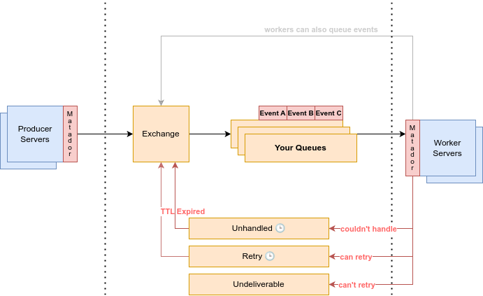

# Matador


An opinionated, batteries-included framework for using event transports (e.g. `RabbitMQ`) with a lot of useful conventions built in.

# Vision

Matador is an _opinionated_ library, which means it makes design choices for you about how you will use events.

- Sending one event to Matador will result in a unique event message will be sent for each subscriber (fanout).
- The topology of the queues used by Matador is of a specific design, managed by Matador itself.
- You are working in a monorepo.
- Most of your usage is simply moving intensive work away from your API servers.

The goals of Matador are to provide:

- An abstracted way to interact with queue backends, so that you can switch between them without refactoring in future.
- A consistent experience for creating events and subscribers.
- Sensible defaults for retries, dead-lettering, undeliverable messages, etc.
- Provide good observability for everything relating to your events and subscribers.

# History

We ([MeetsMore](https://meetsmore.com/)) have been using Matador since 01.2024 to handle 600,000+ successfully processed messages a day.

It has real-world features that we use daily to reliably send, consume, and monitor events.

We use it with `RabbitMQ`, so that is the first-class supported broker.

This version (2.0.0+) was re-written from scratch based on our learnings from the internal version.

# Features

### General

- Conventional types for `Event` and `Subscriber`.
- Map events to a list of subscribers.
- 'Fan out' events from one dispatched event, to one event per subscriber.
- Async configuration hooks so that important parameters can be configured at runtime using feature flags.
- Async lifecycle hooks for plugging into your observability platform.
- Require events to be well documented (require `description`).
- Require subscribers to declare their idempotency type, and use this to manage retry logic automatically.
- Require subscribers to declare their importance, so your observability can trigger correctly prioritized alerts.
- `metadata` field for data that will not be used for business logic (e.g. useful debugging information).
- Wait for pending enqueues and subscribers to complete work before shutting down.
- Allow configuration of any transport for falling back to, if primary queue is down.
- Provide an in-memory `LocalTransport`, which executes subscribers immediately on the same machine they were enqueued to (useful for fallbacks and testing).
- Retry control flow using special errors (`DoRetry` and `DontRetry`), so subscribers can dictate retry logic.
- Clear, actionable errors for all types of error cases.

### RabbitMQ

- Automatically create and manage your queue topology.
- Automatically setup and configure queues and consumers.
- Automatic re-connects on lost connection.
- Debounce AMQP timeout errors to avoid excessive logging noise.
- Poison message detection.
- Channel-per-queue model enabling per-queue concurrency.

# Getting Started

#### Define an Event

An `Event` in **Matador** is a base/abstract class. Your events' classes extend this base class.

Events extend `MatadorEvent` and define their data type inline in the constructor:

```ts
class UserLoggedIn extends MatadorEvent {
  static key: EventKey = 'user.login.successful'                          // The unique name of your event.
  description = 'Triggered when a user logs in successfully.'             // A description of when the event is triggered.

  constructor(
    public data: { userId: string },                                      // The data payload, required for processing.
    public metadata?: { loginMethod: 'email' | 'social' | 'magic-link' }  // [optional] Additional data helpful for logging, debugging, or monitoring.
  ) {
    super()
  }
}
```

#### Define a Subscriber

A `Subscriber` is a listener for events that executes when events are received.
The event-to-subscriber mapping is done during schema registration.

```ts
const detectLoginFraud: Subscriber<UserLoggedInEvent> = {
  name: 'detect-login-fraud',                                                   // The unique name of your subscriber.
  idempotent: 'no',                                                             // Is this operation idempotent?
  targetQueue: 'compliance-jobs-worker',                                        // The queue this subscriber's events should be routed to.
  callback: async (data: UserLoggedInEvent, docket: Docket) => { /** ... */ }   // The work to perform.
}
```

#### Define a Schema

A `MatadorSchema` is a mapping of your `Event`s to `Subscriber`s.

```ts
const myMatadorSchema: MatadorSchema = {
  [UserLoggedIn.key]: [UserLoggedIn, [detectLoginFraud, logEventToBigQuery]]        // Events can have multiple subscribers.
}
```

#### Instantiate `Matador` and dispatch events.

```ts
import { createMatador, createTopology, LocalTransport } from '@meetsmore/matador-v2'

const topology = createTopology()
  .withNamespace('my-app')
  .addQueue('general')
  .build()

const matador = createMatador({
  transport: new LocalTransport(),     // Or use createRabbitMQTransport({ url: '...' })
  topology,
  consumeFrom: ['general'],             // Queues this instance should consume from
})

matador.registerSchema(myMatadorSchema)
await matador.start()
```

```ts
const event = new UserLoggedIn({ userId: '12345' })
await matador.dispatch(event, { metadata: { loginMethod: 'email' } })
```

# CLI

Matador provides a `cli` utility for quick local testing of your Matador config.

```bash
bun cli <config-file> <event-file>
```

Options:
- `--help, -h`    Show help message
- `--dry-run`     Validate config and event without dispatching
- `--timeout`     Timeout in milliseconds for processing (default: 5000)
- `--verbose`     Show verbose output including all hook logs

Example:
```bash
bun cli ./examples/config.ts ./examples/event.ts --verbose
```

# Reasoning

Given **Matador** is opinionated, we should explain why each choice was made.

### Sending one event to Matador will result in a unique event message will be sent for each subscriber (fanout).

There are basically two models that are viable for implementing an event system:

- Messages: Each event is a unique message with a 1:1 relationship to its consumer.
- Topics: Events are 1:N, and all consumers will be notified about the update.

We've chosen '_Messages_', for the following reasons:

- Messages are easier to reason about, there is one message that exists per operation, and successful consumption of that message ends the lifetime of that message.
- Individual messages can be retried, marked as undeliverable, re-driven to other queues, without affecting other subscribers.
- The developers implementing events with Messages have less to think about versus using Topics.

Because our Messages always map to a subscriber Action, our usage of '_Messages_' is a lot closer to a 'Command' pattern.

One of the main disadvantages of using this pattern is that the dispatcher has to know about all subscribers.
We try to alleviate this by including useful constructs for managing this (e.g. `SubscriberStub`)

### The topology of the queues used by Matador is of a specific design, managed by Matador itself.

In order to abstract away a lot of the complexity, and to provide entirely out-of-the-box retry and undeliverability features,
we take ownership over the creation and management of the queues in your chosen backend.

This means that we will create the queue system as we see fit, exposing an abstracted configuration to you for creating the queues you need.

### You are working in a monorepo.

The biggest assumption Matador makes is that you are working in a coding environment where it is easy to share code between packages.
If you are working in a multi-repo organization, Matador will almost certainly be painful to work with and you should choose something else.

The way this is reflected is that it is required to share `Event` and `Subscriber` types between dispatcher and consumer.

### Most of your usage is simply moving intensive work away from your API servers.

Matador was created to provide a quick and easy way for developers to say 'I want this code to run somewhere else', without thinking about it too much.
It's still entirely possible to use it as a basis for a sophisticated event system, but the use-case it shines within is as follows:

- You have API servers running code.
- You have worker servers running the same codebase.
- You want API servers to ask worker servers to run code, using a distributed event system.

If you are mostly using a microservice architecture, you may find that Matador requires too much boilerplate to use across microservices.

# Topology



# API
## Transport

A Transport in **Matador** is an interface for a given backend, e.g. `memory` or `rabbitmq`.

A Transport is responsible for:
 - Translating a `Topology` into native queue infrastructue.
 - All I/O between the broker.

It wraps all of the transport specific logic for hooking up a broker (e.g RabbitMQ).

## Schema

A Schema maps events to subscribers using the following syntax.

```
[EventKey]: [EventClass, SubscriberList]
```

```ts
const myMatadorSchema: MatadorSchema = {
  [UserLoggedIn.key]: [UserLoggedIn, [detectLoginFraud, logEventToBigQuery]]
}
```

`EventKey` is a unique name representing an event.
It should always be set by referencing the static `key` property of your event.

`EventClass` is the class type of your event.
It is used by **Matador** to know what type of event to construct when it receives a payload.

`SubscriberList` is an ordered list of subscribers that should be called for each event.

You can also register subscribers after the schema has been created.

```ts
// This is useful for 'aspect-oriented-programming',
// or when you need to setup Matador in different lifecycle stages.
class AuditLogger {
  start() {
    this.matador.register(UserLoggedIn,  [this.auditSubscriber])
    this.matador.register(UserLoggedOut, [this.auditSubscriber])
  }
}
```

## Events

There are a few ways you will interact with events in **Matador**.

- Subclassing `MatadorEvent` to create your own events.
- Handling events in a `Subscriber`.
- Dispatching events with `dispatch`.

### Envelopes

While you subclass **MatadorEvent** to define a new event, **Matador** wraps these events in _Envelopes_ when they are dispatched. Envelopes contain additional properties like `metadata`, routing information in the `docket`, and attempt tracking.

Your Subscriber callbacks receive the event `data` and the `Docket` (routing metadata).

### 'Fanning out'

When you dispatch an event to Matador, it creates a unique envelope for each subscriber defined in the schema for this event.

This means that all events have a 1-1 relationship with subscribers, even if there are multiple subscibers.

### Metadata

Metadata is passed via `EventOptions` when dispatching events.

This field should contain any information **not** required for an event to be processed, but that is useful for logging, debugging, monitoring, etc.

Separating the metadata from the data in this way is meant to make it clear which properties are necessary for operation and which you can be more lax with.

**Matador** also has the concept of _UniversalMetadata_, which are universal to all your events, for purposes like correlation IDs or session contexts. These are loaded via the `loadUniversalMetadata` hook.

### `dispatch`

Create event instances and dispatch them:

```ts
const event = new UserLoggedIn({ userId: '12345' })
await matador.dispatch(event, { metadata: { source: 'web' } })

// With 'before' for change events
const updateEvent = new UserUpdated({ name: 'New Name' }, { name: 'Old Name' })
await matador.dispatch(updateEvent)
```

### Delayed Message Processing

```typescript
// Delay by 5 minutes
const event = new SendReminderEvent({ userId: '123', meetingId: '456' })
await matador.dispatch(event, { delayMs: 300000 })
```


#### How It Works

1. **RabbitMQ**: Uses `rabbitmq_delayed_message_exchange` plugin. Enable via `enableDelayedMessages` in transport config.
2. **Local**: Uses `setTimeout` for testing/development
3. **Auto-detection**: Matador detects plugin availability at startup

#### Plugin Installation (RabbitMQ)

To use delayed messages, you need to install the `rabbitmq_delayed_message_exchange` plugin.

If the plugin is not installed, Matador will log a warning for any delayed messages, and process them immediately instead.

```bash
rabbitmq-plugins enable rabbitmq_delayed_message_exchange
rabbitmq-server restart
```

Then configure your RabbitMQ transport:
```ts
const transport = createRabbitMQTransport({
  url: 'amqp://localhost:5672',
  enableDelayedMessages: true,
})
```

## Subscribers

Subscribers in Matador listen for events and execute callbacks when those events are received.

There are two types of subscribers:
- `Subscriber`: A full subscriber that processes events
- `SubscriberStub`: A stub subscriber used for declaring subscribers that will be implemented elsewhere

### Idempotency

The `idempotent` property can be set to:
- `'yes'`: Operation can be repeated safely.
- `'no'`: Operation should not be repeated.
- `'unknown'`: Operation idempotency is unknown (same as `no`, useful for migrating old code).

This is used by Matador to determine retry behavior.

### Subscriber Stubs

Subscriber stubs are used when you need to declare a subscriber in one service but implement it in another.

For example, your application will dispatch an event, but it will be consumed in another codebase (maybe not even TypeScript).

They only require the common properties and the `isStub: true` flag.

Example:
```ts
const myStubSubscriber: SubscriberStub = {
  isStub: true,
  name: 'my-subscriber',
  targetQueue: 'general'
}
```

### `enabled`

You can provide an `async` function that, if set, will be used to determine if events for that subscriber should be dispatched.
It does **not** disable consumption, only dispatch, any existing events will still be received.

You can use this to feature flag a given subscribers events.

```ts
{
  isStub: true,
  name: 'send-emails-v2',
  targetQueue: 'email-service-v2',
  importance: 'must-investigate',
  enabled: () =>
    FeatureFlags.getBoolValue('email-service-v2.enabled'),
}
```

## Config

| Property         | Description                                                        | Required | Default         |
|------------------|--------------------------------------------------------------------|----------|-----------------|
| `transport`      | Transport for message delivery (e.g. `LocalTransport`, `RabbitMQTransport`) | ✅       |                 |
| `topology`       | Topology configuration (namespace, queues, dead-letter, retry)     | ✅       |                 |
| `consumeFrom`    | Queues this instance should consume from (empty = no consumption)  |          | `[]`            |
| `hooks`          | Custom lifecycle hooks                                             |          | `undefined`     |
| `codec`          | Message codec for serialization                                    |          | `JsonCodec`     |
| `retryPolicy`    | Custom retry policy                                                |          | `StandardRetryPolicy` |
| `shutdownConfig` | Shutdown configuration (timeouts)                                  |          | See defaults    |

### RabbitMQ Transport Config

| Property                | Description                                                        | Required | Default                   |
|-------------------------|--------------------------------------------------------------------|----------|---------------------------|
| `url`                   | Connection URL (e.g. `amqp://localhost:5672`)                      | ✅       |                           |
| `quorumQueues`          | Use quorum queues                                                  |          | `true`                    |
| `defaultPrefetch`       | Default prefetch count                                             |          | `10`                      |
| `enableDelayedMessages` | Enable delayed message exchange plugin                             |          | `true`                    |
| `logger`                | Custom logger                                                      |          | `undefined`               |

### Topology Configuration

Topology is configured using the `TopologyBuilder`:

```ts
const topology = createTopology()
  .withNamespace('my-app')              // Prefix for all queue names
  .addQueue('general')                   // Add a queue
  .addQueue('heavy-jobs', {              // Queue with options
    concurrency: 5,
    consumerTimeout: 60000,
  })
  .withRetry({                           // Configure retry behavior
    enabled: true,
    defaultDelayMs: 1000,
    maxDelayMs: 300000,
  })
  .withDeadLetter({                      // Configure dead-letter queues
    unhandled: { enabled: true },
    undeliverable: { enabled: true, maxLength: 10000 },
  })
  .build()
```

#### Queue Options

| Property          | Description                                              |
|-------------------|----------------------------------------------------------|
| `concurrency`     | Concurrency for this queue                               |
| `consumerTimeout` | Consumer timeout in milliseconds                         |
| `priorities`      | Enable priority support if transport allows              |
| `exact`           | Use queue name exactly without namespace prefix          |

The `exact` option is useful when referencing external queues not managed by Matador.

## Hooks

**Hooks** allow you to customize the behaviour of Matador while it is running.

It is intended to allow you to plug into a feature flag system like LaunchDarkly.

You can also use hooks to respond to various lifecycle events (like when events are enqueued, processed, or fail).

The lifecycle methods are very useful for unit testing! You can spy on any of them in order to wait until things happen.
They are also where you should integrate your observability platform.

```ts
const myHooks: MatadorHooks = {
  // Logger instance to use for logging
  logger: {
    debug: (message: string, ...args: unknown[]) => { },
    info: (message: string, ...args: unknown[]) => { },
    warn: (message: string, ...args: unknown[]) => { },
    error: (message: string, ...args: unknown[]) => { }
  },
  // Called when a new event is successfully enqueued
  onEnqueueSuccess: async (context) => {},
  // Called when enqueue falls back to a secondary queue
  onEnqueueWarning: async (context) => {},
  // Called when transport fallback occurs (FallbackTransport only)
  onTransportFallback: async (context) => {},
  // Called when a new event failed to enqueue
  onEnqueueError: async (context) => {},
  // Allows you to wrap the processing function (for APM context)
  onWorkerWrap: async (envelope, subscriber, execute) => await execute(),
  // Called before a worker processes a message
  onWorkerBeforeProcess: async (envelope, subscriber) => {},
  // Called when a new event was successfully processed
  onWorkerSuccess: async (context) => {},
  // Called when a new event failed to be processed
  onWorkerError: async (context) => {},
  // Called when message decoding fails
  onDecodeError: async (context) => {},
  // Called when transport connection state changes
  onConnectionStateChange: async (state) => {},
  // Called everytime an event is created, and applies the result to the envelope
  loadUniversalMetadata: () => ({ correlationId: '...' }),
  // Dynamic queue concurrency lookup
  getQueueConcurrency: (queueName) => undefined,
  // Dynamic retry delay lookup
  getRetryDelay: (envelope, attemptNumber) => undefined,
  // Dynamic max attempts lookup
  getAttempts: (envelope) => undefined,
  // Dynamic max deliveries (poison threshold) lookup
  getMaxDeliveries: (envelope) => undefined
}
```

## Logging

All **Matador** logs have the prefix `[Matador]`.

Matador emits the following logs:

- 🔵: `[Matador] 🔌 Delayed message exchange plugin detected`

- 🟡: `[Matador] 🟡 RabbitMQ delayed message exchange plugin not available...`
- 🟡: `[Matador] 🟡 Hook {hookName} threw an error`
- 🟡: `[Matador] ⚠️ Shutdown timeout reached with {n} events still processing`

- 🔴: `[Matador] 🔴 Failed to enqueue delayed message`
- 🔴: `[Matador] 🔴 Handler error in message processing`
- 🔴: `[Matador] 🔴 RabbitMQ connection error`
- 🔴: `[Matador] 🔴 RabbitMQ publish channel error`

Errors are thrown in the following scenarios:

- 🔴 `TransportClosedError`: If trying to enqueue events after transport has been closed/shutdown.
- 🔴 `DoRetry`: Thrown manually by subscribers to force retry of an event regardless of idempotency.
- 🔴 `DontRetry`: Thrown manually by subscribers to prevent retry of an event regardless of idempotency.
- 🔴 `EventAssertionError`: Thrown when an event fails user-defined assertions.
- 🔴 `EventNotRegisteredError`: If an event key is not found in the schema.
- 🔴 `InvalidEventError`: If an event is missing required data or is malformed.
- 🔴 `InvalidSchemaError`: If the schema validation fails.
- 🔴 `LocalTransportCannotProcessStubError`: If local transport receives event for stub subscriber.
- 🔴 `MessageMaybePoisonedError`: If a message has been redelivered too many times.
- 🔴 `IdempotentMessageCannotRetryError`: If a non-idempotent message is retried after a previous delivery.
- 🔴 `NoSubscribersExistError`: If trying to fanout an event with no subscribers.
- 🔴 `NotStartedError`: If trying to use Matador before calling start().
- 🔴 `ShutdownInProgressError`: If trying to dispatch during shutdown.
- 🔴 `QueueNotFoundError`: If trying to enqueue to a queue that doesn't exist.
- 🔴 `SubscriberIsStubError`: If trying to process event for stub subscriber.
- 🔴 `SubscriberNotRegisteredError`: If subscriber not found for event.
- 🔴 `TimeoutError`: If an operation like publish times out.
- 🔴 `TransportNotConnectedError`: If transport is not connected.
- 🔴 `TransportSendError`: If transport fails to send a message.
- 🔴 `AllTransportsFailedError`: If all transports in a fallback chain fail.
- 🔴 `DelayedMessagesNotSupportedError`: If delayed messages plugin is not available.

Check [`packages/matador/src/errors/`](packages/matador/src/errors/) for detailed descriptions of each error and how to action them.

# RabbitMQ

While documenting RabbitMQ is out of scope for this document, we get asked some questions repeatedly, so choose to document some limitations about RabbitMQ here.

### You can't peek messages in RabbitMQ.

To peek a message in RabbitMQ, you have to unqueue it. You can immediately requeue it, but you will put it at the back of the queue.

### You can't filter messages in RabbitMQ.

Consumers always receive the next message at the head of the queue.
If you only want certain messages to be received by certain consumers, you should create a new queue.

A common pattern is that each microservice owns its own queue.

# Further Documentation

Matador has complete JSDoc coverage, if this document doesn't answer your question, check the source code.
